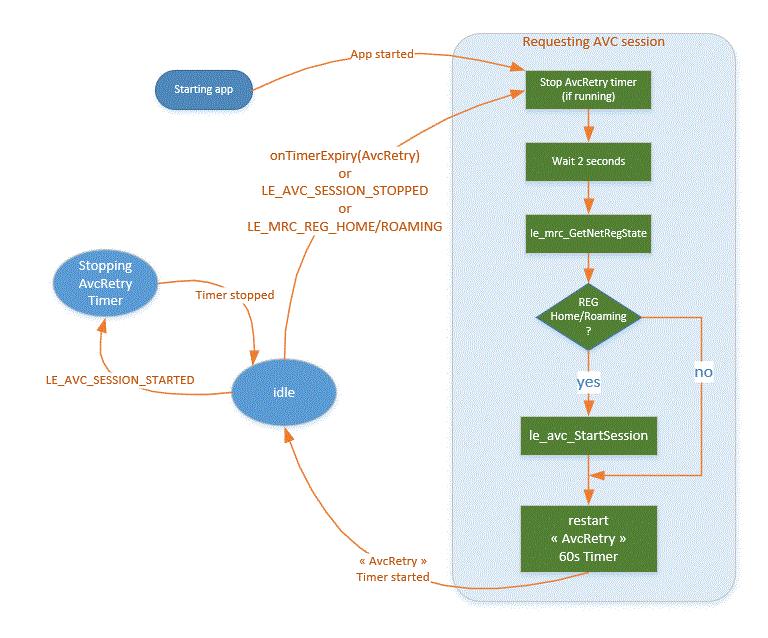

AVC Controller for Legato
=========================

This is a Legato application aiming to maintain a permanent connection with AirVantage :

- Upon module reboot (app is set to autostart in adef)
- Network loss, e.g. deregistered (getting in then out of a tunnel/parking, beyond a delay), SIM/antenna removal/reinsert, anti-aging etc...

This app has been tested on WP76 and WP85 modules using Legato 18.04.

Application Scenario
--------------------
Use this controller to ensure a permanent connection with AirVantage.
You can focus on developing your data applications (asset data, timeserie) without worrying about the connection aspect.

Build
-----
To build executable for WP8549:
~~~
make wp85
~~~

Install the app on target (MangOH/WP8548)
-----------------------------------------
~~~
app install avcController.wp85.update <IP address of target>
~~~

Note on AirVantage Queue Mode
-----------------------------

- AirVantage-orginated commands are queued in the server, they will be sent to the device when it is is online.
- You might find the situation where AirVantage-originated commands are not sent to device although
  an AVC session is already active (per avcController action). This is due the NAT timeout (network tears down the NAT
  if there is no data exchange within a network-specfic delay, could be as short as 20 seconds).
  In this event, the external IP address of the device is no longer valid thus AirVantage cannot send queued commmands.
- The NAT will be restored upon device reconnection (restart AVC session) or upon sending data (invoking dtls resume).
- Using this avcController, if your application needs to receive server commands on a timely manner, then you'd need
  to send data (le_avdata_Push) to AirVantage as often as you expect to receive AirVantage-originated commands.

How it works ?
--------------
